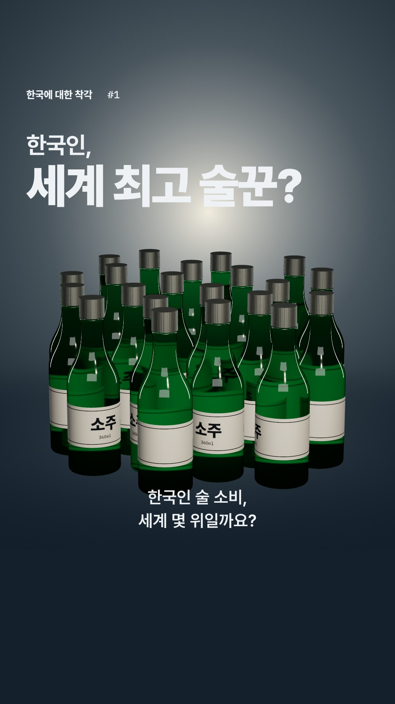
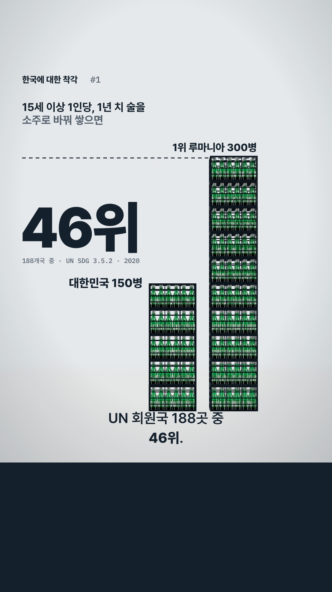
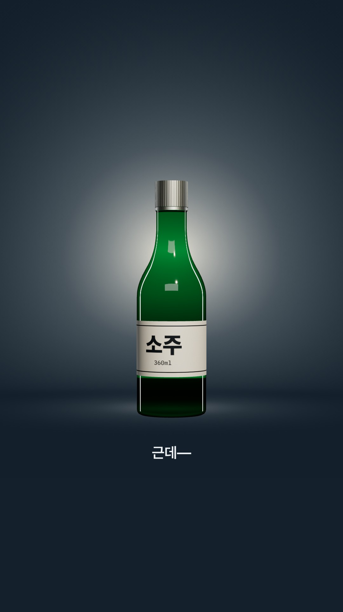
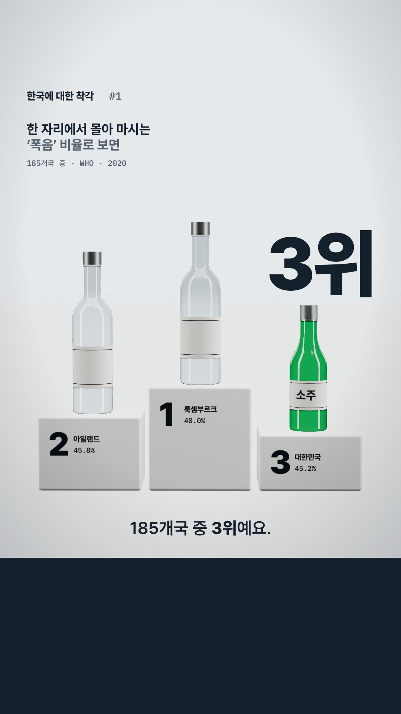
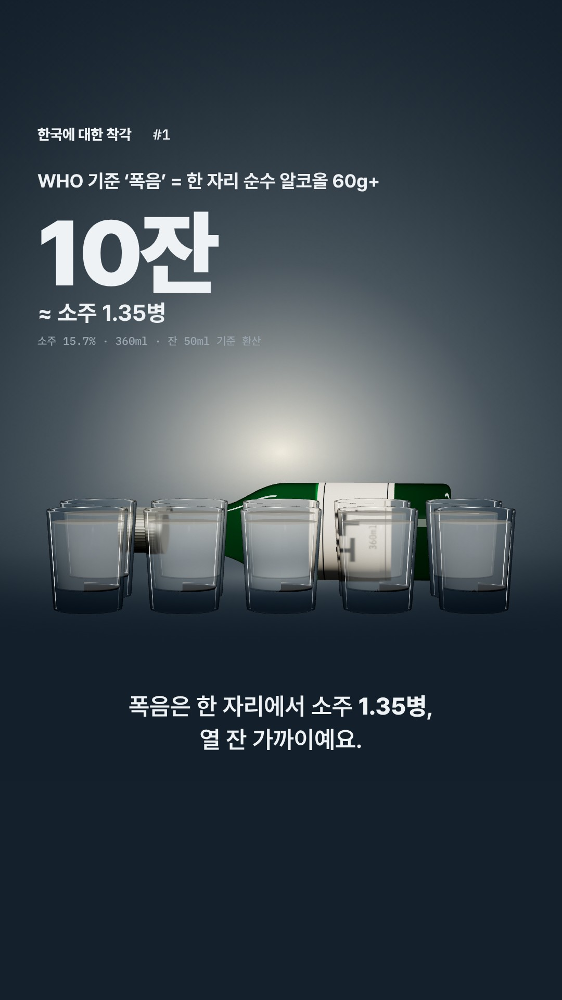
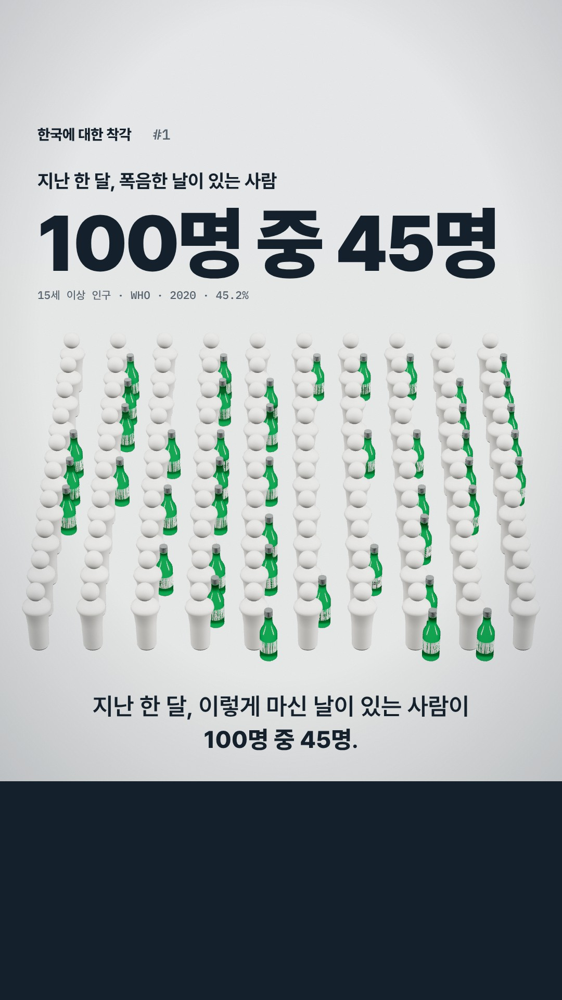
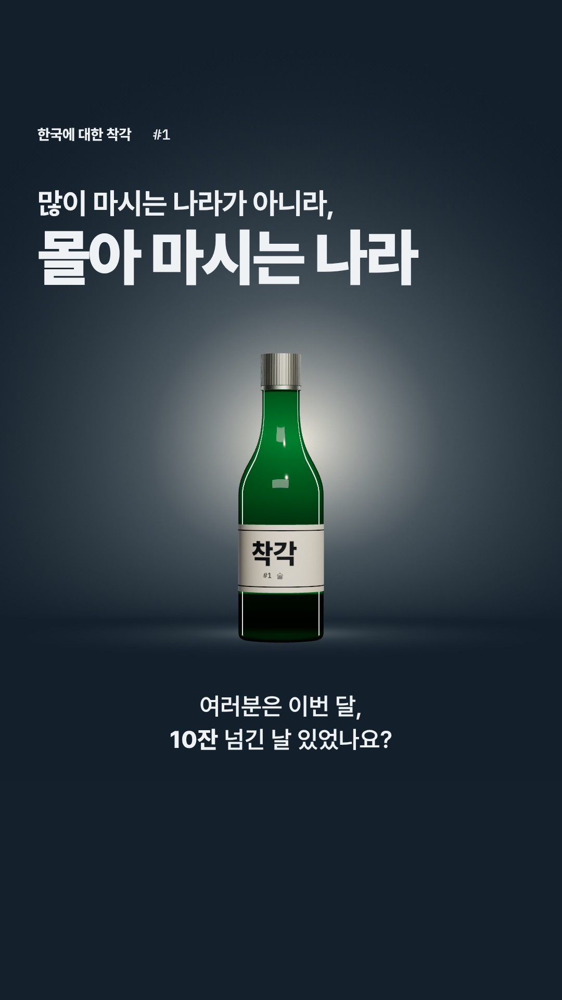

# 술 편 스토리보드 — 「한국에 대한 착각 #1」 (v3, 2026-09-25)

> 이전 A/B/C 16초 비교안(도형 SVG·기본 3D)은 **폐기**. 사용자 피드백: "20년 전 모션그래픽", "기울인 뱃지로 손맛 흉내", "재미·전달력·영상미 없음".
> 이 문서의 프레임 7장은 목업이 아니라 **실제 제작 파이프라인(Remotion + three.js)으로 렌더한 컷**이다 — 승인한 그림이 그대로 애니메이션된다.
> 렌더: `REMOTION_BROWSER=... node scripts/storyboard.mjs` (코드: `src/storyboard/`, 에피소드 코드와 분리된 엔트리)

**카톡 한 줄:** "야 우리나라 술 소비 세계 46위래. 근데 폭음은 3위 ㅋㅋ 많이 마시는 게 아니라 몰아 마시는 나라"

## 방향 — 무엇이 바뀌었나

| 이전 | 이번 |
|---|---|
| 순위를 점·눈금·원기둥으로 옮김 ("46위"를 그림) | **데이터가 곧 물건**: 1년 치 술 = 소주 150병(5짝), 폭음 = 소주 10잔, 45% = 100명 중 45명 |
| 도형 + 평면 조명 | 유리 투과·환경 반사·그림자가 있는 **제품 사진급 렌더**, 주인공 오브젝트 하나(초록 소주병) |
| 기울인 스탬프·테이프로 "손맛" 흉내 | **기울임 없음.** 타이포는 곧은 그리드, 크기 대비로만 위계 |
| 모든 장면 같은 톤 | **조명 리듬**: 어둠 = 질문·반전·의미 / 밝음 = 숫자. 어두운 장면 배경 = 브랜드 잉크색 → 하단 띠와 이어짐 |

한국 표시 규칙(색 X, 형태 O) 유지: 포디움에서 한국만 **소주병 실루엣**, 다른 나라는 다른 모양의 병. 초록은 "한국 색"이 아니라 소주라는 사물의 색.

## 비트 (전체 ~32초, 1–4번 나레이션은 기존 VO 재사용)

| # | 시간 | 나레이션 (자막) | 화면 | 모션 / 전환 | 사운드 |
|---|---|---|---|---|---|
| 1 | 0–2.6s | 한국인 술 소비, 세계 몇 위일까요? *(기존)* |  술자리 끝난 테이블처럼 빽빽한 소주병, "세계 최고 술꾼?" | 병들이 하나씩 탁·탁 내려앉으며 쌓임(첫 1초), 카메라 천천히 푸시인 | 병 내려놓는 소리 연타, 술집 룸톤 |
| 2 | 2.6–7.5s | UN 회원국 188곳 중 **46위**. 생각보다 한참 아래죠. *(기존)* |  1인당 1년 치 술을 소주 짝으로 쌓음: 한국 5짝(150병) vs 1위 루마니아 10짝(300병) | 1번 병들이 짝에 담기며 한국 탑이 먼저 쌓이고, 루마니아 탑이 그 위로 계속 올라감 → 점선(1위 높이) 긋고 "46위" 착지 | 짝 쌓일 때 둔탁한 "퉁", 46위에 저음 히트 |
| 3 | 7.5–8.6s | 근데— *(기존)* |  불 꺼지고 병 하나만 | **하드컷 암전**, 뒤 조명만 켜짐 | 음악 정지, 병 "팅" 한 번 |
| 4 | 8.6–13s | 한 번에 몰아 마시는 '폭음'으로 보면, 185개국 중 **3위**예요. *(기존)* |  시상대: 1 룩셈부르크 48.0 · 2 아일랜드 45.8 · **3 대한민국 45.2** | 조명 복귀하며 카메라 뒤로 → 3번 병이 시상대 위에 서 있음, 1·2위 병이 위에서 툭 떨어져 제자리 | 불 켜지는 "철컥", 착지 효과음 |
| 5 | 13–18s | 폭음은 한 자리에서 소주 **1.35병**, 열 잔 가까이예요. *(신규)* |  소주잔 10개 | 병이 기울어 잔 10개를 차례로 채움, 좌상단 카운터 1→10잔 | 잔마다 따르는 소리 + 틱 |
| 6 | 18–24s | 지난 한 달, 이렇게 마신 날이 있는 사람이 **100명 중 45명**. *(신규)* |  100명 중 45명 옆에 소주병 | 카메라가 잔 하나에서 솟아올라 100명을 내려다봄, 45명 옆에 병이 무작위 순서로 톡톡 등장 | 잔 부딪히는 소리 산발, 웅성임 |
| 7 | 24–32s | 많이 마시는 나라가 아니라, 몰아 마시는 나라였던 거죠. / 여러분은 이번 달, **10잔** 넘긴 날 있었나요? *(신규)* |  라벨이 "착각"인 병 한 병 | 사람·병 사라지고 한 병만 남음 → 마지막 1초에 1번 테이블로 루프 | 음악 마무리 + 시리즈 사운드 로고 |

신규 나레이션 TTS 초안 (`episode.json` 확장용, eleven_v3):
- 5: `폭음은 한 자리에서 소주 한 병 넘게, 열 잔 가까이예요.` — 정확한 수치(1.35병)는 자막과 화면이 보여줌 ("한 병 반"은 1.5라서 쓰면 안 됨)
- 6: `지난 한 달, 이렇게 마신 날이 있는 사람이, 백 명 중, 마흔다섯 명.`
- 7: `[thoughtful] 많이 마시는 나라가 아니라, 몰아 마시는 나라였던 거죠.` / `여러분은 이번 달, 열 잔 넘긴 날 있었나요?`

## 숫자 근거 (모두 `src/episodes/alcohol/data.json`에서 계산)

| 화면 | 계산 | 출처 |
|---|---|---|
| 한국 150병 / 루마니아 300병 | 1인당(15세+) 순수 알코올 8.47L·16.93L × 789g/L ÷ 소주 1병 알코올 44.6g(15.7%·360ml) = 149.8 · 299.5 | UN SDG 3.5.2, 2020 |
| 5짝 / 10짝 | 플라스틱 소주 짝 = 30병 (마트 종이박스는 20병 — 그래서 화면엔 항상 "150병"을 같이 표기) | 업계 표준 P-box |
| 46위 / 188 | UN 회원국만 다시 순위 | 〃 |
| 3위 / 185, 45.2% | 지난 30일 한 자리에서 순수 알코올 60g 이상 마신 15세 이상 인구 비율 (음주자 중이 아니라 **전체 인구** 중) | WHO, 2020 |
| 10잔 ≈ 1.35병 | 60g ÷ 44.6g = 1.35병 × 360ml = 486ml ÷ 50ml 잔 = 9.7잔 | WHO 폭음 정의 |
| 100명 중 45명 | 45.15% 반올림 | WHO, 2020 |

캡션 필수 문구: "순수 알코올 기준으로 소주(15.7%·360ml) 환산. 맥주·와인 등 모든 술 포함 / WHO 폭음 기준 = 한 자리 순수 알코올 60g 이상 / 2020년, UN 회원국 기준".

## 결정이 필요한 것

1. **이 방향(물건=데이터, 제품 렌더, 어둠/밝음 리듬)으로 갈지.**
2. 나레이션에 "다섯 짝"을 넣을지 — 재밌지만 "짝=20병" 아는 사람이 댓글 달 수 있음. 지금은 화면에만 병 수 명시.
3. 시상대 톤 — 동메달 목걸이 같은 농담을 얹을지, 지금처럼 담담하게 둘지 (음주 미화 금지 원칙).
4. 사운드를 어디서 만들지 — 아래 참고.

## 사운드 · ElevenLabs

- 효과음(Sound Effects API)·음악(Music API)은 ElevenLabs로 만드는 게 맞음. 다만 **이 클라우드 환경은 네트워크 정책이 `api.elevenlabs.io`를 차단**하고 있고 API 키도 없음. 클라우드에서 하려면 환경 설정에서 해당 도메인 허용 + `ELEVENLABS_API_KEY`·`ELEVENLABS_VOICE_ID` 환경 변수 추가(새 세션부터 적용). 아니면 로컬에서 `prep.mjs` / `sfx.mjs` 실행.
- **이미지 생성은 쓰지 않음.** 모든 프레임이 실제 렌더라 필요 없고, AI 이미지는 "AI 티"와 "승인한 그림 ≠ 움직이는 그림" 문제가 생김. 참고로 ElevenLabs Image & Video API는 **Pro 플랜 이상**이 필요함(현재 Creator).

## 남은 약점 (솔직히)

- 여전히 CG 티는 남음: 유리 초록이 균일하고 바닥 반사·굴절 왜곡이 없음. "좋은 제품 렌더" 수준이지 일러스트레이터 작품 수준은 아님.
- 6번(100명)이 가장 약함 — 사람이 흰 말(pawn)이라 대비가 낮고 빽빽함.
- "재미"의 대부분은 모션·사운드에서 나오는데 스틸로는 안 보임 → 승인 나면 1번→2번 전환만 먼저 5초 애니메이틱으로 보여주고 확인받을 것.
- 렌더 속도: 소프트웨어 GL에서 프레임당 3–20초 → 32초(960프레임) 전체는 1–3시간. 초안은 0.5배 해상도로.
